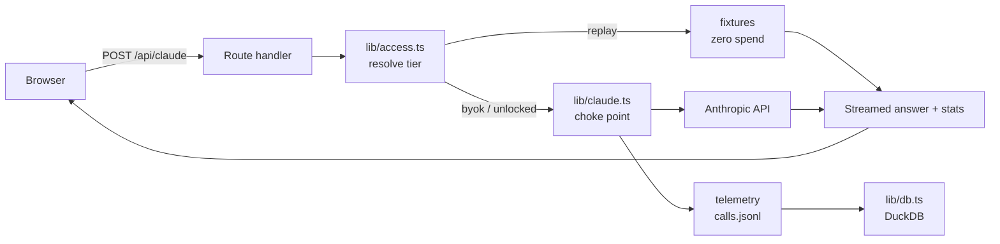

# Frontera

A streaming Claude workspace built with Next.js. Every model call runs through a
single logged choke point, so tokens, latency, and cost stay observable — the
foundation for adding evals, cost tracking, and guardrails as the app grows.

**▶ Live demo: [frontera-beta.vercel.app](https://frontera-beta.vercel.app)** — no signup, no key
required. Anonymous visitors get canned responses at zero API spend; the UI says
so on every call.

> **Demo recording pending** — see [`docs/README.md`](docs/README.md) for what to
> capture. Once `docs/demo.gif` exists, replace this quote block with:
> ``

## What this demonstrates

| Feature | Capability it shows |
|---------|--------------------|
| Single `lib/claude.ts` choke point every call goes through | Observability by construction — tokens, latency, and model land in one place, so evals and cost tracking have somewhere to attach |
| Per-answer stats readout in the UI | The numbers the server logs are the numbers the user sees; observability you can't see doesn't count |
| Three access tiers (replay / BYOK / unlock) | Cost and abuse design on a public LLM endpoint: the default tier can't spend money, and live tiers are opt-in |
| Signed httpOnly unlock cookie, timing-safe compare | Auth hygiene without a database; the client can't forge or read it |
| Self-expiring, per-recipient invite links | Capability URLs done carefully: signature verified before any field is trusted, domain-separated from session cookies, revocable in bulk by secret rotation |
| Prompt-length cap + bounded `max_tokens` | Both sides of the spend surface are bounded, not just the output |
| Canned fixtures labeled in-product | Honest demo UX — a visitor is never misled into thinking a replay is a live model |

## Architecture



## Try it

The demo endpoint has three access tiers, resolved per request:

- **Demo mode (default):** anonymous visitors get clearly-labeled canned
  responses. Zero API spend, so the live link is safe to share publicly.
- **Bring your own key:** paste an Anthropic API key in the **Access & keys**
  panel to get live answers billed to you. The key is kept in your browser tab
  (`sessionStorage`), sent only with your own requests, and never stored or
  logged server-side.
- **Password unlock:** a shared password enables live answers on the host's key
  (for a guided walkthrough). It sets a signed, httpOnly cookie.
- **Invite link:** a signed, per-recipient, self-expiring URL that unlocks the
  live tier on click — no password to type. Mint one with
  `npm run invite -- --label acme --days 14`. The token carries its own expiry
  and label, is HMAC'd with a domain-separation prefix (so it can't be swapped
  with a session cookie), and redemptions are logged by label. Rotating
  `UNLOCK_COOKIE_SECRET` invalidates every outstanding link at once.

## Stack

- Next.js 15 (App Router) + TypeScript + React 19
- Anthropic SDK (`@anthropic-ai/sdk`), streaming responses
- DuckDB (`@duckdb/node-api`) for local analytics over the call log
- Deployed on Vercel

## Local setup

```bash
npm install
cp .env.example .env.local   # add your ANTHROPIC_API_KEY
npm run dev                  # http://localhost:3000
```

Record fresh demo-mode fixtures (needs a live key):

```bash
npm run fixtures:record
```

Mint an invite link (signs with `UNLOCK_COOKIE_SECRET`, so it must match the
deployment you're minting for):

```bash
npm run invite -- --label jane --days 14 --base https://frontera-beta.vercel.app
```

Run the tests (Node's built-in runner, native TypeScript — no framework, no
build step):

```bash
npm test
```

Query the local call log:

```bash
npm run db -- "SELECT tier, count(*), sum(outputTokens) FROM calls GROUP BY tier"
```

## Environment

| Var | Required | Purpose |
|-----|----------|---------|
| `ANTHROPIC_API_KEY` | yes | House key for local dev and the unlocked tier |
| `DEMO_UNLOCK_PASSWORD` | for unlock | Password visitors type to enable live answers |
| `UNLOCK_COOKIE_SECRET` | for unlock | HMAC secret signing the unlock cookie |
| `CLAUDE_MODEL` | no | Override the model (default `claude-sonnet-5`) |
| `DUCKDB_PATH` | no | Local DuckDB file path (default `data/frontera.duckdb`) |

## Roadmap

Structured status drafting, an agentic risk register, retrieval-grounded
project memory, an eval dashboard, and reliability tooling — each landing as a
new route on the same logged choke point.

## License

MIT
